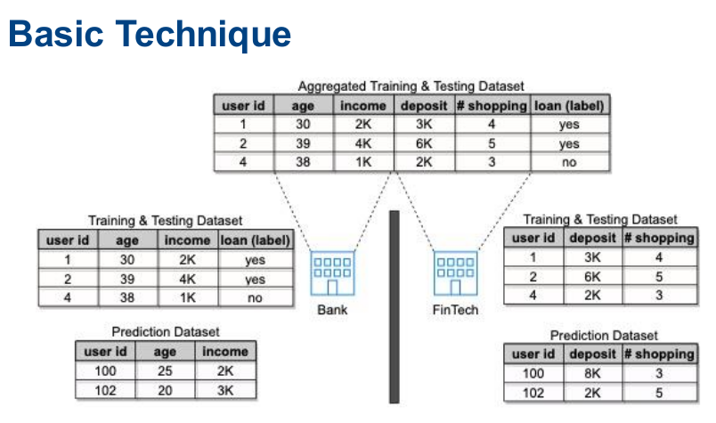

# Vertical Federated Learning (VFL)

Currently we focus on cross-silo collaboration in VFL.

* parties have the same samples but with different features
* only one party has the label, i.e., **the active party**
  * other parties are called **passive parties**

## Basic Technique

The parties have the same sample ids
- but with different features
- only the active party has the label information
- the label cannot be directly shared in plaintext

### Training Stage

In the training stage of this setting, the parties except the active party cannot
train a local model due to no label information. Thus, for each iteration, all
the parties need to collaborate to compute the model parameters. Note that the
model parameters usually are distributed among parties, since each party has her
own feature space. 

### Serving Stage

In the serving stage of this setting, each party has the trained model and a 
subset features of an input sample. Therefore, the parties need to collaboratively
provide the serving service.

## Vertical Algorithms

* **Linear Model**
  * [logistic regression](linear_model/README.md)
